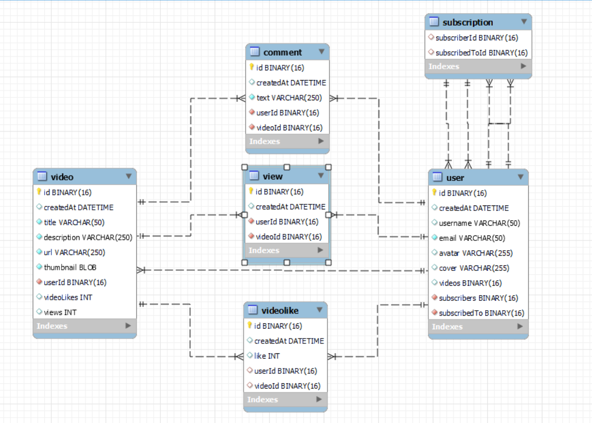

# SlavinnTube - video sharing app

This project is a simple implementation of the popular video sharing website youtube where users can watch, like, share, comment and upload their own videos.

## Technologies

Project is created with:

* Java
* Spring Boot
* Hibernate
* Junit
* Mockito
* Mysql
* AWS S3 Bucket
* Angular

### Database scheme

